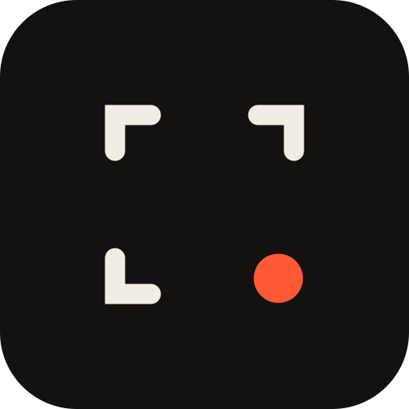

<p align="center">
  
</p>

<h1 align="center">Piqa</h1>

<p align="center"><strong>One shot. Every day.</strong></p>

<p align="center">
  The fair daily photo game — blind-judged, finite, no feed, no followers, works offline.
</p>

<p align="center">
  <a href="#how-it-works">How it works</a> ·
  <a href="#why-piqa-is-different">Why it's different</a> ·
  <a href="#tech-stack">Tech stack</a> ·
  <a href="#architecture">Architecture</a> ·
  <a href="#getting-started">Getting started</a> ·
  <a href="#roadmap">Roadmap</a>
</p>

---

## How it works

1. **📸 Today's Shot drops** — once a day, at a random time in your region's waking hours, everyone in the world gets the same photo challenge ("something red within reach").
2. **You shoot it** — in-app camera only, any time before midnight. No gallery uploads, no filters, no AI images. What you see is what was shot today.
3. **The world curates** — photos face off in anonymous head-to-head pairs. No names, no follower counts, no likes to farm. Just two photos and a pick.
4. **Morning reveal** — wake up to the gallery: the top ~20% of the day's shots, crowned by one Photo of the Day. Your streak, your hearts, your archive — then the app tells you to go live your life.

Five minutes a day. That's the whole app. On purpose.

## Why Piqa is different

| Everyone else                                  | Piqa                                                                            |
| ---------------------------------------------- | ------------------------------------------------------------------------------- |
| Infinite feed engineered to keep you scrolling | Finite by design — content runs out daily                                       |
| Likes + followers decide what wins             | Blind pairwise voting + Bradley-Terry ranking — the _photo_ wins                |
| Pay for boosts, swaps, exposure                | Money can never touch outcomes. Ever.                                           |
| Streaks that punish and guilt-trip             | Weekly goals, free shields, comeback bonuses — lapsed users only get rewards    |
| Losses, ranks, and comparison anxiety          | Positive-only: hearts shown, losses never; follower counts hidden from everyone |
| Breaks on bad connections                      | Offline-first — capture time counts, not upload time                            |

## Tech stack

- **App:** [Expo](https://expo.dev) (React Native, TypeScript strict, Expo Router)
- **Backend:** [Supabase](https://supabase.com) — Postgres, Auth, Storage + CDN, Edge Functions, pg_cron
- **Ranking:** live Elo for matchmaking → Bradley-Terry MLE fit at close (order-independent, late-submitter fair)
- **Push:** Expo Push → FCM, fan-out jittered to avoid thundering herds
- **Moderation:** NSFWJS on-device pre-upload scan + report/quarantine pipeline
- **Icons:** [Lucide](https://lucide.dev) · **Type:** Clash Display / Instrument Sans / IBM Plex Mono

## Architecture

```
┌─────────────┐   capture-first,     ┌──────────────────────────────┐
│  Expo app   │   offline queue      │           Supabase           │
│             │ ───────────────────▶ │                              │
│  Today      │   thumbnail first,   │  Postgres (RLS everywhere)   │
│  Gallery    │   full-res follows   │  Storage (signed URLs)       │
│  ● Camera   │                      │                              │
│  Archive    │ ◀─────────────────── │  Edge Functions:             │
│  Profile    │   materialized       │   drop-prompt  (00:05 UTC)   │
└─────────────┘   gallery JSON       │   get-matchup  (sets of 10)  │
                                     │   close-day    (BT fit, 8am) │
                                     └──────────────────────────────┘
```

The daily cycle follows the sun: one prompt per calendar day, three region buckets (APAC / EU-Africa / Americas), each with its own randomized drop inside local 9am–9pm. Voting runs from drop until 8am; the gallery reveals at 9am like a morning paper.

## Dev setup

```bash
npm install
cp .env.example .env        # Supabase URL + anon key

npx supabase start          # local stack (or link the cloud project)
npx supabase db push        # apply schema + RLS
npm run gen:types           # regenerate lib/types.ts after ANY schema change

npx expo start
```

Build for device: `eas build -p android --profile preview`
Requirements: Node 20+, Android device/emulator (test on a budget device, not just a flagship).

## Project structure

```
app/
  (tabs)/            today · gallery · archive · profile + nav layout
  camera.tsx         full-screen capture (modal route)
  photo/[id].tsx     full-res view
components/
  tokens.ts          Darkroom design system (ink · paper · safelight)
  atoms/  molecules/  moments/
lib/
  supabase.ts  types.ts (generated)
supabase/
  migrations/        schema + RLS
  functions/         drop-prompt · get-matchup · close-day
docs/
  piqa-spec-final.md the complete product spec
```

## Design principles

1. **Fairness** — blind judging, exposure never tied to votes cast, no paid advantage.
2. **Finiteness** — bounded everything. No infinite feed, ever.
3. **Positivity** — losses never shown, comments don't exist, lapsed users only receive rewards.
4. **Shooting is free, the stage is scarce** — unlimited private capture, one public slot a day.
5. **North star = retention, never session length.**

The full rationale — personas, competitor post-mortems, ranking math, moderation pipeline — lives in [`docs/piqa-spec-final.md`](docs/piqa-spec-final.md).

## Roadmap

- [x] Product spec, design system, brand kit
- [ ] MVP: capture → offline queue → submit → curate → morning gallery
- [ ] Closed beta (Play Store, 12 testers / 14 days)
- [ ] Public Android launch
- [ ] Showcase walls · squads · collections
- [ ] iOS

## Working rules (for me + Claude Code)

- **The spec is law:** [`docs/piqa-spec-final.md`](docs/piqa-spec-final.md). Any feature idea gets checked against §0 Design Laws before a line is written. Feeds, visible rankings, and paid advantages are permanently out.
- Build order = spec §20. `/dev/kit` component demo first; screens are assembly.
- Every schema change: migration file + `npm run gen:types` in the same commit.
- Thresholds (gallery %, caps, quorum, windows) live in the `config` table — never hardcode.
- Offline path is sacred: no feature ships if it breaks capture-without-signal.

## Pre-launch checklist

- [ ] joinpiqa.com bought · @piqa handles claimed · IPOPHL classes 9/42 searched
- [ ] Play Console account + `com.joinpiqa.piqa` reserved
- [ ] 12 closed-test recruits confirmed (14-day requirement)
- [ ] 60 prompts written (2-month buffer)
- [ ] Privacy policy + ToS + community guidelines pages live
- [ ] Data Safety form matches privacy policy
- [ ] NSFWJS gate + report/block + account deletion verified on device

---

<p align="center"><em>Got the shot?</em> 📸</p>
